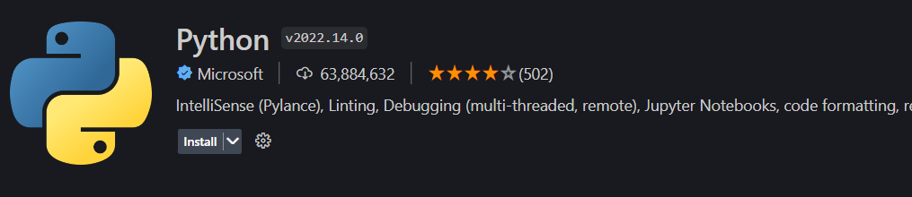
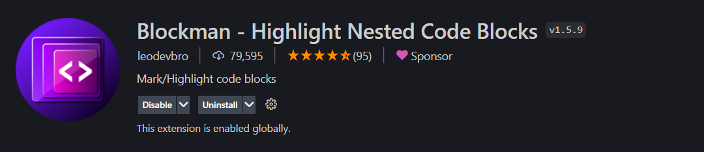
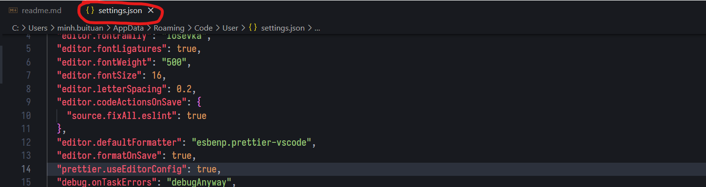

# Hướng dẫn cài đặt extension python và lint

## Cài đặt python và pycodestyle

### 1. Python (pip)

Tải về python tại https://www.python.org/

### 2. Pycodestyle

Sau khi cài xong python, chạy command sau

```shell
pip install pycodestyle
```

## Cài extension vscode

Vào phần extension của Visual Studio Code và cài các extension dưới đây:

### 1. Python

Extension hỗ trợ cú pháp và lint cho python


### 2. Blockman

Extension dùng để đánh dấu highlight codeblock cho dễ nhìn.


## Cấu hình extension

Mở Visual Studio Code và thực hiện như các bước bên dưới:

#### 1. Mở file settings.json

Nhấn Ctrl + Shift + P, tìm kiếm `setting` và chọn như sau


Thấy cửa sổ file settings.json mở ra là ok


#### 2. Cấu hình

##### 2.1. Setting pycodestyle và lint tự động khi lưu file

Thêm đoạn json sau vào file settings.json

```json
  "python.linting.pycodestyleEnabled": true,
  "python.linting.lintOnSave": true
```

#### 3. Done

Sau khi thực hiện các bước trên, lưu file settings.json và khởi động lại Visual Studio Code.
